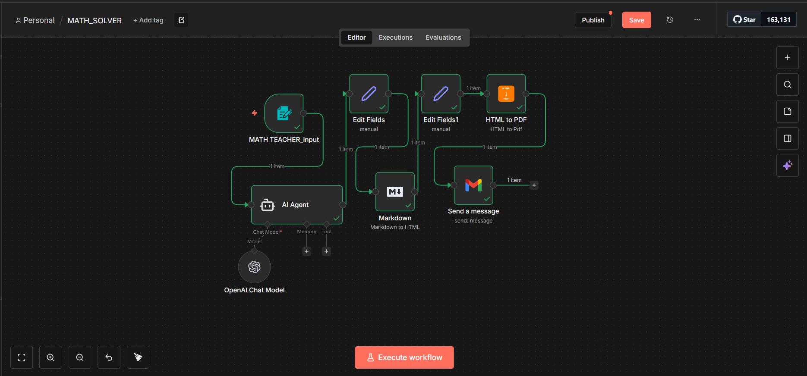

# AI Maths Solver Automation (n8n)

This repository contains an automated **AI-powered Maths Solver workflow** built using **n8n**.

The goal of this project is to demonstrate how **AI + workflow automation** can produce
structured, reusable, and shareable educational content — not just raw AI responses.

## 🚀 What the workflow does

- Accepts a maths question as input
- Uses an AI Agent to generate step-by-step explanations
- Formats the output using Markdown
- Converts the content into a clean PDF
- Automatically delivers the PDF via email

All steps are fully automated.

## 🧠 Key ideas behind the project

- AI answers are easy — structured output is hard
- Automation turns AI into a usable system
- Output quality matters as much as intelligence

## 🛠️ Tech stack

- n8n (Cloud)
- AI Agent (LLM-powered)
- Markdown-based content pipeline
- HTML → PDF conversion
- Email delivery (Gmail)

## 📂 Repository structure

See the folders:
- `workflows/` – n8n workflow JSON
- `prompts/` – system prompts used by the AI agent
- `examples/` – sample inputs and outputs

## 📸 Workflow & Sample Output

### 🖼️ Automation Workflow

### 📄 Sample Generated PDF
👉 [Click here to view the generated maths solution PDF](assets/sample-output.pdf)

## 📌 Use cases

- EdTech automation
- Assignment solution generation
- Study material creation
- AI workflow orchestration demos

## 🤝 Contributions

This is an experimental project.  
Ideas, feedback, and improvements are welcome.
